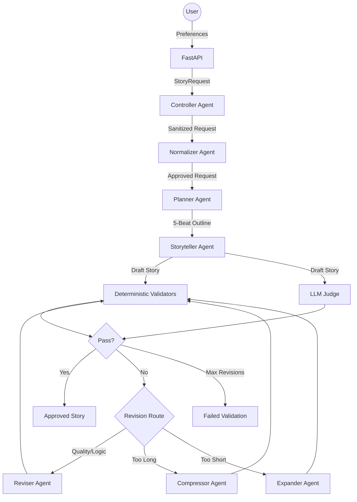

# 🌙 Bedtime Story Generator

A professional, production-grade agentic AI pipeline designed to generate high-quality, child-safe bedtime stories for children aged 5–10.


## 🚀 Overview

This project implements a **bounded LLM agent pipeline** that transforms simple user preferences into rich, structured narrative experiences. It uses a multi-stage architecture to ensure safety, alignment, and literary quality.

### Key Features

- **Multi-Agent Orchestration**: Controller, Normalizer, Planner, Storyteller, Judge, and Reviser agents working in sequence.
- **Deterministic Guardrails**: Zero-LLM validators for word count, character consistency, and genre drift.
- **Fail-Closed Safety**: Strict normalization of user input and judge-led revision loops ensure no unsafe content reaches the child.
- **Production-Ready Backend**: FastAPI with rate limiting, structured logging, and Pydantic validation.
- **Modern Frontend**: React + Vite interface showing the "thinking" (audit trail) behind each story.

## 🏗️ Architecture

The system follows a modular, pipe-and-filter architecture where each stage is handled by a specialized agent or validator.



## 🛠️ Tech Stack

- **Backend**: Python 3.10+, FastAPI, OpenAI API, Pydantic, SlowAPI.
- **Frontend**: React, Vite, CSS3.
- **Testing**: Pytest, HTTPX.
- **Tooling**: Python-dotenv, Pydantic-settings.

## 🚦 Getting Started

### 1. Backend Setup
1. Navigate to the `backend` directory:
   ```bash
   cd backend
   ```
2. Install dependencies:
   ```bash
   pip install -r requirements.txt
   ```
3. Run the server (must be on port 8000):
   ```bash
   uvicorn app.api:app --reload
   ```

### 2. Frontend Setup
1. Navigate to the `frontend` directory:
   ```bash
   cd frontend
   ```
2. Install dependencies:
   ```bash
   npm install
   ```
3. Run the development server:
   ```bash
   npm run dev
   ```

## 📖 Available Views

- **Reviewer View** ([http://localhost:5173/reviewer](http://localhost:5173/reviewer)): Full technical evaluation UI for interviewers/developers. Shows audit trails, judge scores, and validator results.
- **Kids View** ([http://localhost:5173/kids](http://localhost:5173/kids)): Simplified, child-friendly story experience. Shows only approved stories with gentle visuals.

## 🧪 Testing
```bash
cd backend
pytest
```

## 📖 Documentation

For deeper dives into the system design and policies, refer to the `docs/` directory:

- [System Design](docs/SYSTEM_DESIGN.md) — Detailed architecture and agent roles.
- [Prompt Design](docs/PROMPT_DESIGN.md) — Strategies used for LLM reliability.
- [Safety & Guardrails](docs/SAFETY.md) — How we protect young readers.
- [API Reference](docs/API.md) — Endpoint documentation.
- [Test Plan](docs/TEST_PLAN.md) — Verification strategy.

## 📜 License

MIT License. See [LICENSE](LICENSE) for details.
