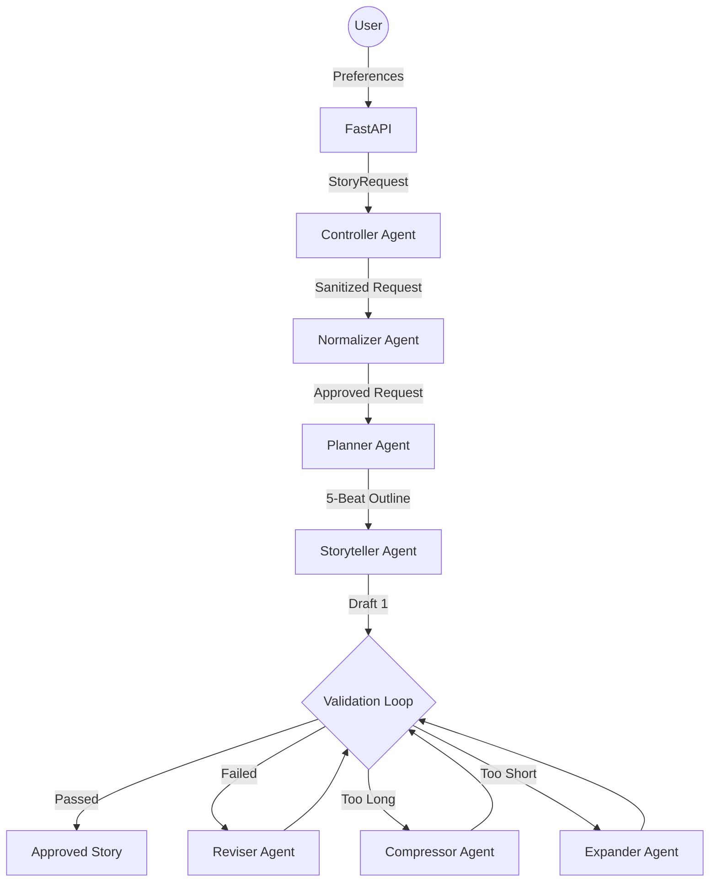
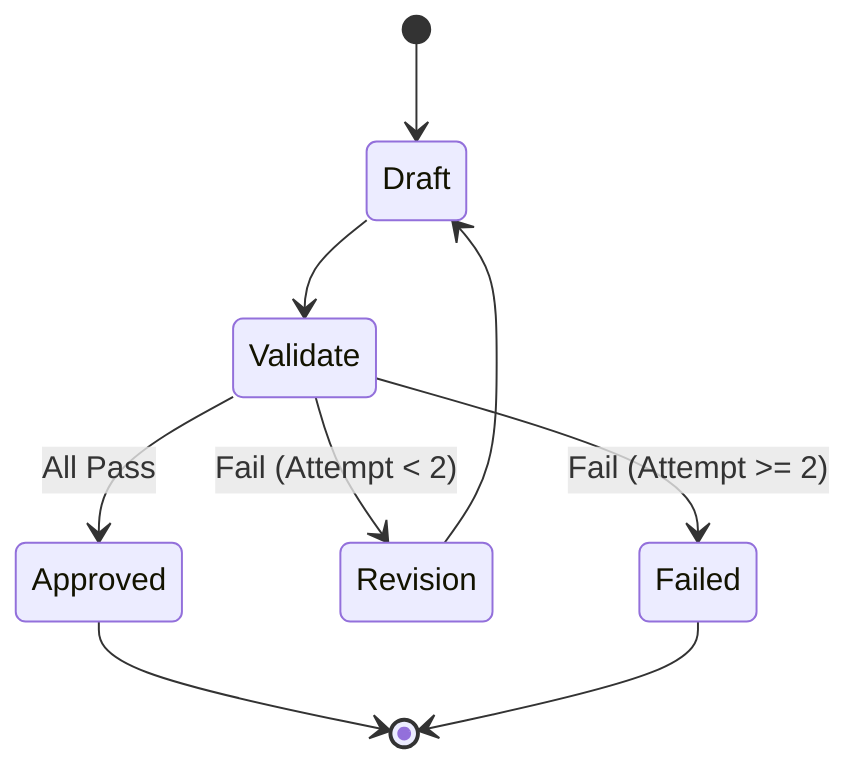

# System Design

## Architecture Overview

The Bedtime Story Generator uses a **pipe-and-filter agentic architecture**. This modular approach ensures that each step of the creative process is isolated, observable, and verifiable.

## Agent Roles

1.  **Controller Agent**: Interprets the raw user request and preferences. It sets the target age band, theme, and tone.
2.  **Normalizer Agent**: The safety guardian. It scans for copyrighted characters (e.g., Marvel/Disney) or unsafe themes and rewrites them into child-safe, original alternatives.
3.  **Planner Agent**: Generates a 5-beat narrative outline. Planning before writing prose prevents "hallucinated" scary twists and ensures logical progression.
4.  **Storyteller Agent**: Transforms the outline into rich, age-appropriate prose. It adheres strictly to the word count and stylistic constraints defined in the rulebook.
5.  **Judge Agent**: Evaluates the draft against an 8-dimension rubric (Emotional Safety, Bedtime Suitability, Readability, etc.).
6.  **Revision Agents**:
    - **Reviser**: Performs surgical fixes for quality or logic issues.
    - **Compressor**: Aggressively shortens stories that exceed the word limit.
    - **Expander**: Adds sensory details to stories that are too brief.

## Controlled Revision Loop

The system implements a **fail-closed** revision loop to ensure only high-quality content is served.

## Data Integrity
All communication is governed by strict **TypedDict** schemas (see `app/models/schemas.py`). This ensures a strong data contract and enables the **Audit Trail** feature, which records every thought and decision made by the system.
